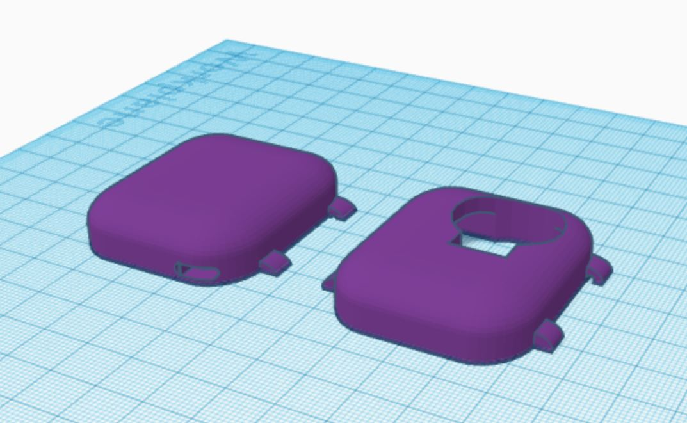
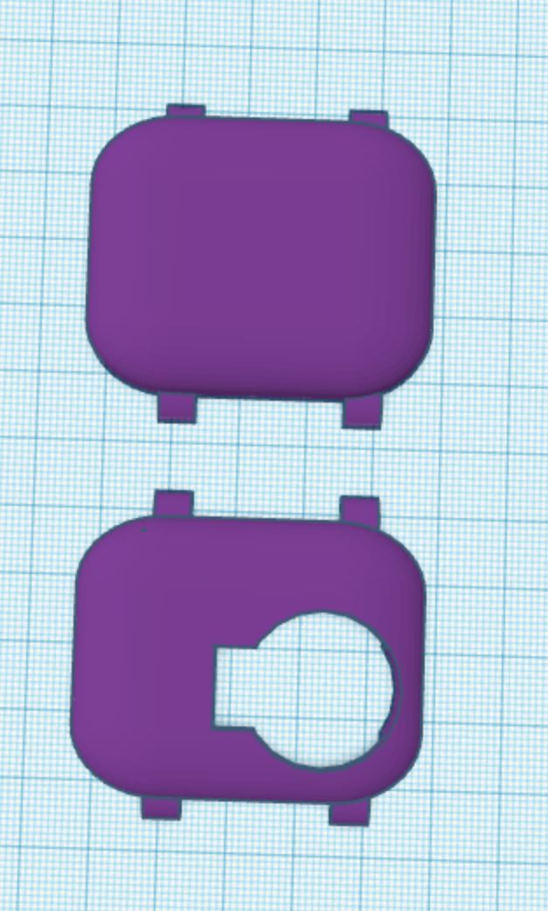
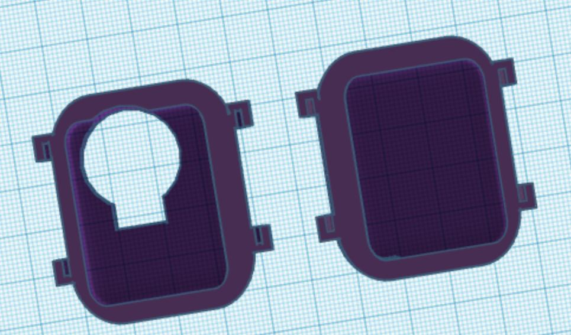
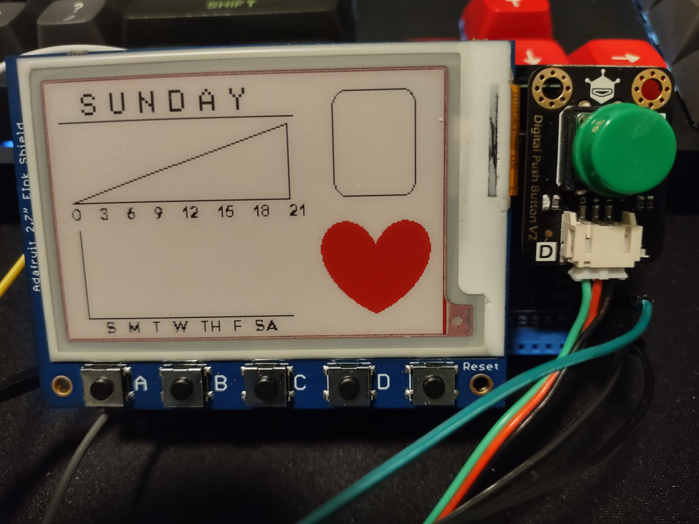
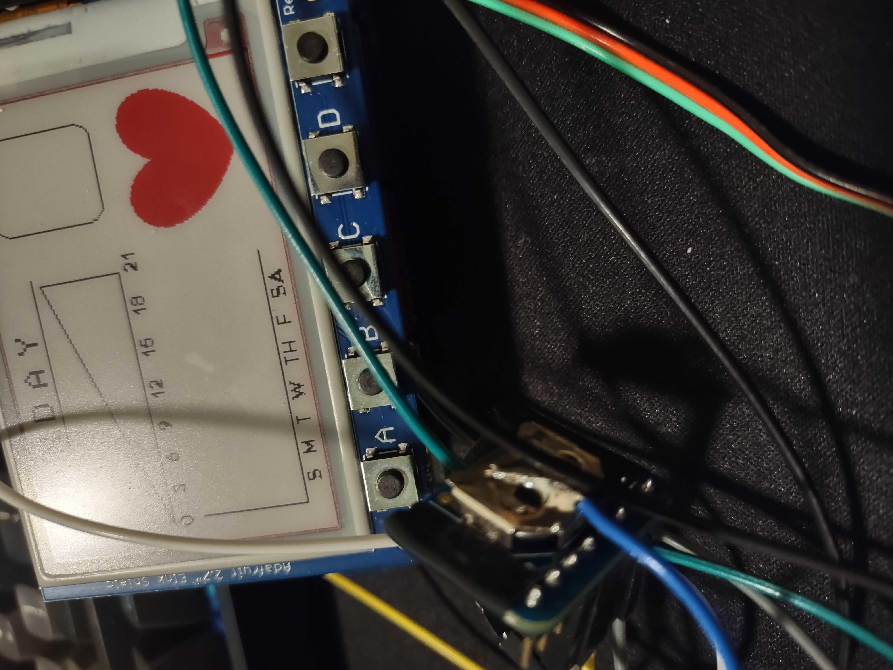

# ECE 1895 Design Project 3
The purpose of this project is to complete part of the University of Pittsburgh's Electrical Engineering ciriculum, where students choose and design a project based on personal interests.

## Design Proposal (11/1/2022)
My project will be a two part sleep tracker that allows the user to log data about each night's sleep and try to quantify it and correlate it with a good or bad night's of rest.

It will consist of a Wrist Tracker and Base. The Wrist Tracker will have a heart rate monitor and gyroscope/accelerometer, this will allow the user to grab information about their heart rate, which is vital to establishing sleep quality. The gyroscope/accelerometer will allow the user to get movement information, so if the user was tossing and turning in their sleep then the Wrist Tracker can monitor it. In order to keep the size small and comfortable while sleeping a small Lithium battery will be used to power the Wrist Tracker.

The Wrist Tracker will have Bluetooth to connect to the Base. The Base will have a microphone that monitors the sound level throughout the night, it will also have a e-ink screen that displays the data logged from the past night. In addition, the Base will have three colored buttons: green, yellow, and red corresponding to good, okay, and bad night of sleep, respectively. This will be the user's sleep quality opinion as it is only based on how the user thinks they slept and doesn't take into account any sensor data. The Base will also have an SD card to store many nights worth of data, because the Base can sit beside the bed, it will just be powered via USB through a wall port.

### Minor Goals/Check Points
If unable to complete all of the proposed design I would like to end the class with the following

- Fully working Wrist Tracker
- Wrist Tracker communicates through Bluetooth to computer sending every sensor read 
- Computer stores each sensor read and allows for multi-night tracking
- Computer software that allows for inputting user sleep quality opinion
- Computer software that plots all sensor reads and evaluates taking into consideration user sleep quality opinion
- Computer software computes a sleep quality rating

### Personal Learning Goals
I've never worked with wireless electronics and would like to test myself with Bluetooth communication. Additionally, I've never tackled a project of this size or complexity so I understand it may not be do-able within the time frame (6 weeks). 

Table of Pros/Cons that may lead to successful completion of all goals
| Pros         | Cons |
|--------------|:-----:|
| 
 Chose all breakout components 
 No PCB designing 
 Plenty of sample software for sensors 
 Only doing READs from sensors| 
 Limited time (6 weeks) 
 First Motherboard choice out of order 
 Lots of coding to create a communication and data logger 
 No refined plans for casings of Wrist Tracker or Base 
 Yellow button out of order| 

---

## Update 1 (11/17/2022)

### Wrist Tracker
DFRobot_Heartrate.cpp file modified because value to determine heart rate was too high and heart rate kept registering as 0 BPM (NOT REALISTIC)

### Base Station

| Task | Status | Notes/Future Planning |
|------|--------|:---------------:|
| Make Dashboard graphic |  Basic outline completed | Uses bitMaps to load images from SD cards |
|Added basic user sleep score functionality| Updates Dashboard with sleep score, but does NOT store the value | Will need to figure out an efficient way to draw triangle for weekly sleep score without having to generate each image individually or can make a bunch of options and load onto SD card |
| Purchased Ardiuno Mega clone |Awaiting shipment|Basic sketch for eInk display took up 83% of storage and needed to switch from ATMEGA328P to ATMEGA2560-16au. This increases the amount of sketch memory by about 8 times |

---

## Update 2 (12/1/2022)

### Wrist Tracker
* Started designing enclosure using TinkerCAD

### Base Station
* Recieved Arduino Mega in the mail and assembled the base with the e-ink display, button, and added a real-time-clock for timestamping the data sent

* Added to code the day of the week and the ability to redo a day if user entered in the wrong sleep score

* Added green button to start the night tracking and ends tracking when a user enters a sleep score for the night

---

## Update 3 (12/17/2022)

Biggest issue is lack of Bluetooth, everything can be sent while wired but can't transmit wirelessly

Wrist tracker can send data through wire via Serial port and there is an [executable Java file](https://circuitjournal.com/arduino-serial-to-spreadsheet) that allows Serial to .csv

Plan to create a Python script that takes the data recieved from the wired tracker and calculates the average heart rate as well as finds the max and minimum rate of the night. The motion tracking has a very low G threshold and calculates how much of the night was spent moving around (NOTE: not a very good metric)

---

## Update 4 (12/18/2022)

Tried to make heart rate display on base from a randomly generated number to simulate data, tried to fix RTC

## Update 5 (12/19/2022)

Went to record demo videos and made everything 100% worse. Killed both USB ports on my laptop and Arduino is stuck on uploading screen.

Trouble shooting steps taken:
* Tested Base code using Arduino Uno first then Arduino Mega, neither uploaded properly and would create a weird bug where it was getting stuck in a boot loop
* Removed all pins and connections and grounded reset pin, then replugged in to verify recognition

---
---

# Final Design

Overall working parts:

Base (As of 12/19/2022 Not any more)
* User score selection
* Night data collection start time and end time
* E-ink display

Wrist Tracker
* Collects heart rate within 5 bpm of an over the counter finger heart rate sensor
* Collects motion movement from the gyroscope
* Currently needs to be wired in for transmitting through Serial

### Future Work/Conclusion
Even though everything works individually, I struggled with getting everything to work together. I knew that the Bluetooth component was going to be the most complicated, but I didn't realize it was going to be this hard.

I chose break out boards and Arduinos with Bluetooth built in, because I thought it would make interfacing easier, but it was the opposite. There was a lot more information about the break out board components from Adafruit and how to use them then the built in DFRobot Arduino clones I bought.

I really wanted to challege myself and prove that I could make a successful design project; however, I can't help but feel that I failed. I had sought to make a sleep tracking device that allowed user feedback from the user based on how they rated the quality of their sleep. I understand that commercial solutions such as Garmin watches (the main inspiration of my project) take many years to develop and have hundreds of people behind the product to support successful releases and that I am just one person. I'm not sure if only focusing on doing either the Wrist Tracker or the Base instead of attempting to do both would have resulted in further progress.

Besides the Bluetooth, I do think that a Python script would be easy to implement; however, I ran out of time.

*New conclusion (12/19/2022), I never want to do hardware related stuff again, I'm more of a software person and this project ended up a complete failure. I was very ambitous and hopeful at the start however, I realize working on a team such as with the Bop-It project, team strengths could be utilized more. I have much more experience with coding and woodworking which is why Bop-It gave me a false sense of hope that I could manage a project of this size on my own.*

---

***Final note (unrelated to the technical details)***
Why did I want to do this project? 

Earlier this summer, I had to put my childhood pet dog down and I was working at a co-op rotation that I really didn't like. All of that combined this summer, led to me becoming very anxious about my future career in engineering. The loss of my best friend, even if it was just a dog, really carried on throughout the rest of the year, and during this fall semester, I was officially diagnosed with severe depression and put on antidepressants. The medication made me extremely tired and my brain very foggy, but prior to it I was prone to insomnia. The conflicting cycle of my natural lack of sleep and the medicine started re-emerging as my body got used to the medicine. I was dealing with all of this while managing 18 credits in 6 classes. I constantly felt that I was doing poorly, because I kept comparing myself to previous semesters' me; although, that me didn't have nearly as many stressors or classes, I still feel the need to keep up. This project meant a lot to me, because I was hoping that I could help my insomnia, by giving me data to quantify my sleeping habits and feel better about engineering as a career, by completing a project successfully. 

I wanted to tell you, Dr. Dickerson, to let you know that even though it looks like I don't have that much work put together, I genuinely did try my best given my other life circumstances.

---

Demo Link: 
* [Wrist Tracker Demo](https://youtu.be/G4DGXG8Q42c)
