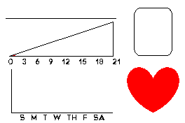

# Base Documentation

## **Part Product Pages (Guide Links)**

Here are the parts you will need to build a Base Station with links to each part's guide page

- Motherboard [ELEGOO MEGA](https://www.elegoo.com/products/elegoo-mega-2560-r3-board)
- E-paper display [Adafruit 2.7" Tri-color Shield](https://www.adafruit.com/product/4229)
- Serial Data Logger 

## Graphics

**Dashboard**

Outline of what the Base Dashboard will look like, on the *line* to the left the date will be displayed, *rounded box* will display the user's sleep score (a number 1-3) for the current sleep cycle, *red heart* will display the average heart heart of the user during the current sleep cycle, *triangle* will show the sleep score for the current week, *graph* will show the average heart rate per night throughout the week.

  
